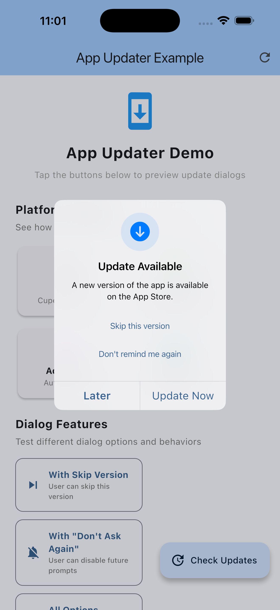
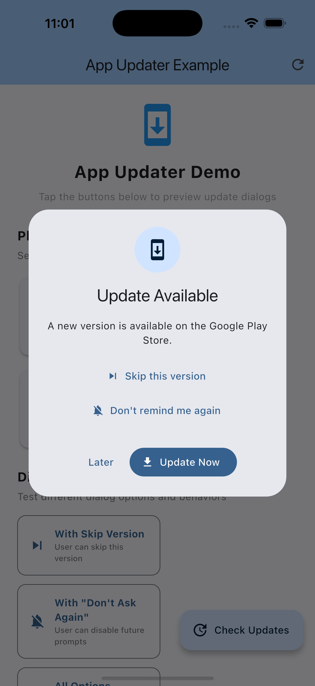
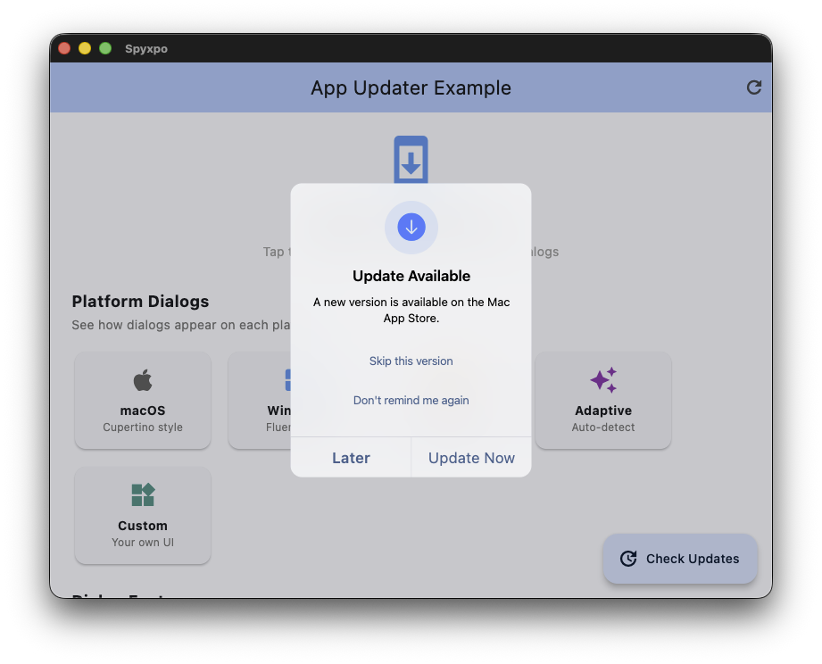
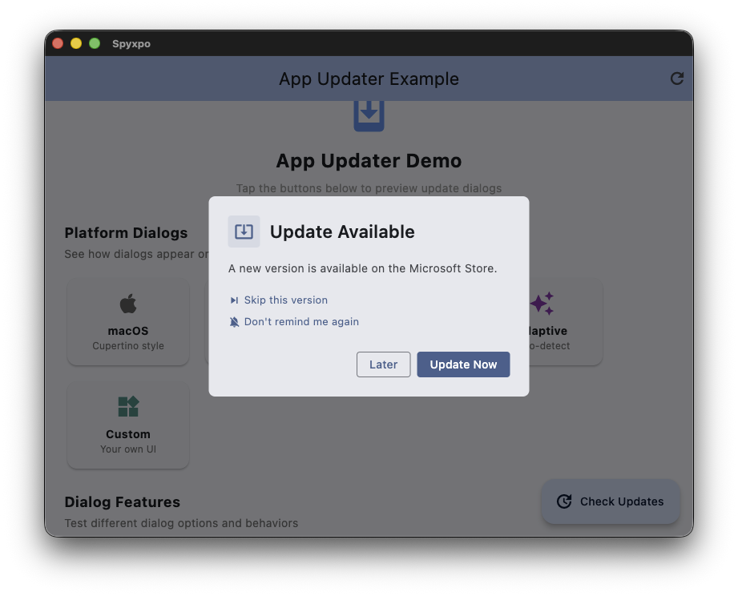
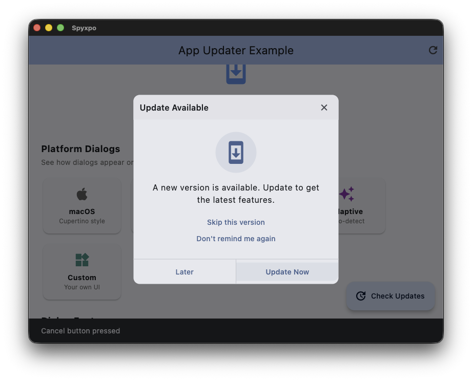

# App Updater

[](https://github.com/mantreshkhurana/app_updater)
[](https://pub.dartlang.org/packages/app_updater)

Check for app updates and show platform-native dialogs. Supports iOS, Android, macOS, Windows, and Linux with adaptive UI for each platform.

| Platform | Dialog Style |
|----------|--------------|
| iOS |  |
| Android |  |
| macOS |  |
| Windows |  |
| Linux |  |

## Features

- **Platform-Specific Dialogs**: Native UI for each platform (Material, Cupertino, Fluent, Adwaita)
- **Persistent Dialogs**: Force users to update with non-dismissible dialogs
- **Skip Version**: Let users skip specific versions
- **Do Not Ask Again**: Remember user's preference to not show update dialogs
- **Custom Endpoints**: Support for custom XML/JSON version endpoints

### Supported Platforms

| Platform | Store | Dialog Style |
|----------|-------|--------------|
| iOS | App Store | Cupertino |
| Android | Play Store | Material Design 3 |
| macOS | Mac App Store | Cupertino |
| Windows | Microsoft Store | Fluent Design |
| Linux | Snap Store / Flathub | Adwaita (GNOME) |

## Installation

Add `app_updater` to your `pubspec.yaml`:

```yaml
dependencies:
  app_updater: ^3.0.0
```

## Quick Start

```dart
import 'package:app_updater/app_updater.dart';

// Create an AppUpdater instance
final appUpdater = AppUpdater.configure(
  iosAppId: '123456789',
  macAppId: '987654321',
  microsoftProductId: '9NBLGGH4NNS1',
  snapName: 'my-app',
  flathubAppId: 'com.example.myapp',
);

// Check for updates and show dialog
final updateInfo = await appUpdater.checkAndShowUpdateDialog(context);

if (updateInfo.updateAvailable) {
  print('New version available: ${updateInfo.latestVersion}');
}
```

## Usage

### Basic Usage

```dart
// Create AppUpdater with configuration
final appUpdater = AppUpdater.configure(
  iosAppId: '123456789',
  // androidPackageName is auto-detected!
);

// Check and show dialog if update available
await appUpdater.checkAndShowUpdateDialog(context);
```

### All Platforms

```dart
final appUpdater = AppUpdater.configure(
  // Mobile
  iosAppId: '123456789',
  androidPackageName: 'com.example.app', // Optional - auto-detected
  // Desktop
  macAppId: '987654321',
  microsoftProductId: '9NBLGGH4NNS1',
  snapName: 'my-app',
  flathubAppId: 'com.example.myapp',
  linuxStoreType: LinuxStoreType.snap, // or LinuxStoreType.flathub
);
```

### Dialog Styles

The package provides 5 dialog styles that match each platform's design language:

```dart
await appUpdater.showUpdateDialog(
  context,
  dialogStyle: UpdateDialogStyle.adaptive, // Auto-selects based on platform
);

// Or force a specific style:
// UpdateDialogStyle.material   - Material Design 3 (Android)
// UpdateDialogStyle.cupertino  - iOS/macOS native
// UpdateDialogStyle.fluent     - Windows Fluent Design
// UpdateDialogStyle.adwaita    - Linux GNOME/Adwaita
```

### Persistent (Forced) Updates

For critical updates that users must install:

```dart
await appUpdater.checkAndShowUpdateDialog(
  context,
  isPersistent: true,  // Cannot be dismissed
  isDismissible: false,
  title: 'Critical Update Required',
  message: 'Please update to continue using the app.',
);
```

### Skip Version & Do Not Ask Again

Let users control update notifications:

```dart
await appUpdater.checkAndShowUpdateDialog(
  context,
  showSkipVersion: true,    // Shows "Skip this version" option
  showDoNotAskAgain: true,  // Shows "Don't remind me again" option
);
```

### Managing Preferences

```dart
// Check if user skipped a version
final isSkipped = await UpdatePreferences.isVersionSkipped('2.0.0');

// Check if user chose "do not ask again"
final doNotAsk = await UpdatePreferences.isDoNotAskAgain();

// Reset all preferences
await UpdatePreferences.clearAll();

// Reset only skipped version
await UpdatePreferences.clearSkippedVersion();
```

### Custom Update Server (JSON)

Host your own version endpoint:

```json
{
  "version": "2.0.0",
  "url": "https://example.com/download"
}
```

```dart
final appUpdater = AppUpdater.configure(
  customJsonUrl: 'https://example.com/version.json',
);
```

### Custom Update Server (XML)

```xml
<?xml version="1.0" encoding="UTF-8"?>
<app>
  <version>2.0.0</version>
  <url>https://example.com/download</url>
</app>
```

```dart
final appUpdater = AppUpdater.configure(
  customXmlUrl: 'https://example.com/version.xml',
);
```

### Check Without Dialog

```dart
final updateInfo = await appUpdater.checkForUpdate();

print('Current: ${updateInfo.currentVersion}');
print('Latest: ${updateInfo.latestVersion}');
print('Update available: ${updateInfo.updateAvailable}');
print('Store URL: ${updateInfo.updateUrl}');
```

### Open Store

```dart
// Open the appropriate store for the current platform
await appUpdater.openStore();

// Or use the convenience function
await openAppStore(
  iosAppId: '123456789',
  microsoftProductId: '9NBLGGH4NNS1',
);
```

### Callbacks

```dart
await appUpdater.checkAndShowUpdateDialog(
  context,
  onNoUpdate: () {
    ScaffoldMessenger.of(context).showSnackBar(
      const SnackBar(content: Text('App is up to date!')),
    );
  },
  onUpdate: () {
    print('User chose to update');
  },
  onCancel: () {
    print('User cancelled');
  },
);
```

### Custom Dialog

```dart
await appUpdater.showUpdateDialog(
  context,
  customDialog: AlertDialog(
    title: const Text('Custom Update Dialog'),
    content: const Text('A new version is available!'),
    actions: [
      TextButton(
        onPressed: () => Navigator.pop(context),
        child: const Text('Later'),
      ),
      FilledButton(
        onPressed: () {
          Navigator.pop(context);
          appUpdater.openStore();
        },
        child: const Text('Update'),
      ),
    ],
  ),
);
```

## API Reference

### AppUpdater

| Method | Description |
|--------|-------------|
| `AppUpdater.configure(...)` | Create instance with individual parameters |
| `AppUpdater(config)` | Create instance with `AppUpdaterConfig` |
| `checkForUpdate()` | Check for updates, returns `UpdateInfo` |
| `showUpdateDialog(context, ...)` | Show update dialog |
| `checkAndShowUpdateDialog(context, ...)` | Check and show dialog if update available |
| `openStore()` | Open the appropriate app store |
| `getStoreUrl()` | Get store URL for current platform |

### UpdateDialogStyle

| Style | Platform | Description |
|-------|----------|-------------|
| `adaptive` | All | Auto-selects based on platform |
| `material` | Android | Material Design 3 |
| `cupertino` | iOS/macOS | Native Apple design |
| `fluent` | Windows | Microsoft Fluent Design |
| `adwaita` | Linux | GNOME/Adwaita style |

### UpdateInfo

| Property | Type | Description |
|----------|------|-------------|
| `currentVersion` | `String` | Current app version |
| `latestVersion` | `String?` | Latest available version |
| `updateUrl` | `String?` | Store/download URL |
| `updateAvailable` | `bool` | Whether update is available |

### UpdatePreferences

| Method | Description |
|--------|-------------|
| `isVersionSkipped(version)` | Check if version is skipped |
| `skipVersion(version)` | Skip a specific version |
| `isDoNotAskAgain()` | Check "do not ask again" preference |
| `setDoNotAskAgain(value)` | Set "do not ask again" preference |
| `clearAll()` | Clear all preferences |
| `clearSkippedVersion()` | Clear skipped version only |

## Migration from v2.x

```dart
// Before (v2.x)
final updateInfo = await checkAppUpdate(
  context,
  iosAppId: '123456789',
);

// After (v3.x)
final appUpdater = AppUpdater.configure(
  iosAppId: '123456789',
);
final updateInfo = await appUpdater.checkAndShowUpdateDialog(context);
```

## Notes

- Update dialogs won't work on iOS Simulator (no App Store)
- Android package name is auto-detected if not provided
- Custom endpoints take priority over store checks

## Credits

- [url_launcher](https://pub.dev/packages/url_launcher)
- [package_info_plus](https://pub.dev/packages/package_info_plus)
- [shared_preferences](https://pub.dev/packages/shared_preferences)

## Author

- [Mantresh Khurana](https://github.com/mantreshkhurana)
